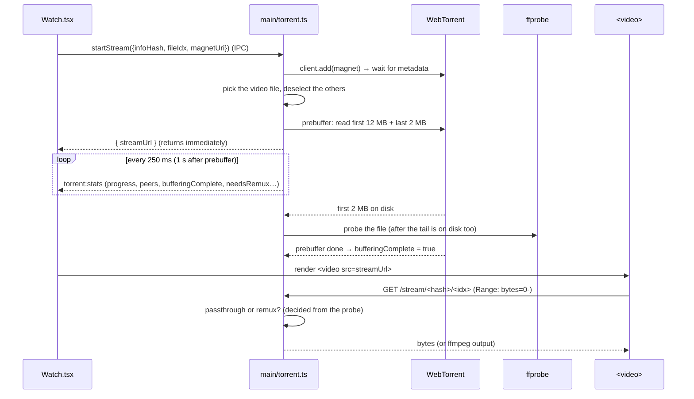

# How streaming works in RELAX

A guide for new contributors. It explains how a magnet link turns into a movie
playing in a `<video>` element: torrents, the local stream server, ffprobe,
ffmpeg, seeking and subtitles. Read it top to bottom once; after that the
"Where to look" table and the debugging checklist are the useful bits.

> Paths are relative to `apps/electron/src/`. Line numbers drift, so search
> for the function names instead.

---

## 1. The problem we're solving

A browser `<video>` element only knows how to do one thing: fetch a URL over
HTTP (with `Range` requests) and play it. It knows nothing about BitTorrent.

So the whole design is: **pretend the torrent is a normal file on a normal web
server.**

```
 ┌──────────────── Electron main process (Node.js) ─────────────────┐
 │                                                                   │
 │   WebTorrent client ──► local HTTP server on 127.0.0.1:8088       │
 │   (downloads pieces)     /stream  /raw  /disk  /sub  /mkvsub      │
 │                                │                                   │
 │                         ffprobe / ffmpeg (child processes)        │
 └────────────────────────────────┼──────────────────────────────────┘
                                  │ http://localhost:8088/stream/<hash>/<file>
 ┌────────────────────────────────▼──────────────────────────────────┐
 │  Renderer (React)                                                  │
 │    <video src="http://localhost:8088/stream/...">                  │
 │    + our own controls, subtitle overlay, stats                     │
 └───────────────────────────────────────────────────────────────────┘
```

Two processes, two jobs:

- **Main process** (`main/torrent.ts`, `main/ffmpeg.ts`): downloads the torrent,
  serves it over HTTP, and converts audio when needed.
- **Renderer** (`renderer/src/components/VideoPlayer/`): plays the URL and
  draws the UI. It talks to the main process only through the `window.relax`
  bridge (`preload/index.ts` → IPC).

---

## 2. Where to look

| File | What lives there |
|---|---|
| `main/torrent.ts` | WebTorrent client, sessions, prebuffer, probe orchestration, the HTTP server and all its routes, IPC handlers |
| `main/ffmpeg.ts` | ffprobe/ffmpeg binary paths, `probeFile`, codec support rules, `spawnRemux`, `spawnSubtitleExtract` |
| `preload/index.ts` | The `window.relax.torrent` bridge (IPC wrappers) |
| `renderer/src/lib/torrent.ts` | Typed wrappers around the bridge + `useTorrentStats` |
| `renderer/src/pages/Watch.tsx` | Starts/stops the stream for a page visit |
| `components/VideoPlayer/index.tsx` | Wires all player hooks together, renders `<video>` + controls |
| `…/hooks/useVideoPlayback.ts` | The `<video>` driver: seeking, remux time offset, progress saving, error recovery |
| `…/hooks/useSubtitles.ts` | Subtitle discovery, loading, windowed MKV extraction, cue timing |
| `…/hooks/useAudioTracks.ts` | Audio-track list and switching |
| `…/hooks/useAudioFx.ts` | Volume boost / night mode (Web Audio) |

---

## 3. What happens when you press Play

Follow this once in the code with the debugger and the rest of the system
makes sense.



Step by step:

1. **`Watch.tsx`** calls `startStream(...)` on mount and `stopStream(...)` on
   unmount. That's IPC to `start()` / `stop()` in `main/torrent.ts`.
2. **`start()`** adds the magnet to WebTorrent, waits for the torrent metadata
   (the file list), then:
   - `pickInitialFile` chooses the file (the one the user picked, else the
     largest video file).
   - `selectOnly` tells WebTorrent to download **only** that file.
   - Creates a **`Session`** object for this torrent. It holds everything we
     know about the playback: the on-disk path, the probe result, the selected
     audio track, the prebuffer progress.
   - Starts the **prebuffer** (section 4) and a **stats timer** that pushes
     progress to the renderer over IPC.
   - Returns `http://localhost:8088/stream/<hash>/<idx>` straight away. It does
     not wait for any data.
3. The renderer shows `BufferingOverlay` until the stats say
   `bufferingComplete: true`, and only **then** mounts the `<video>`. That way
   the first `GET` already has data to serve and the video starts instantly.
4. Chromium requests `/stream/...`, and `handleStream` decides how to serve it
   (section 6).

---

## 4. The most important idea: two ways to read a file

WebTorrent writes pieces into a normal file on disk
(`~/Library/Application Support/Relax/torrents/...`). **Pieces we haven't
downloaded yet are just zeros in that file.** Torrents don't download in
order, so a file can look like this:

```
[ downloaded ][ zeros  ][ downloaded ][   zeros   ][ downloaded ]
```

So there are two very different ways to read it:

| | `file.createReadStream()` (WebTorrent) | Reading the path on disk |
|---|---|---|
| Missing piece | **Waits** and asks peers for it with high priority | Returns **zeros** instantly |
| Good for | Playback, anything that needs real bytes | Quick reads of parts we *know* are downloaded |
| Side effect | Triggers downloads | None |

Getting this wrong causes the worst bugs in this codebase. ffmpeg reading zeros
produces corrupt video ("VideoToolbox decode error"), and the MKV parser crawls
through gigabytes of zeros byte by byte. That's why we have three byte routes:

| Route | Reads via | Used by | Why |
|---|---|---|---|
| `/stream/<hash>/<idx>` | WebTorrent (or ffmpeg) | `<video>` | What the player plays (section 6) |
| `/raw/<hash>/<idx>` | WebTorrent | ffmpeg remux input | ffmpeg must never see zeros |
| `/disk/<hash>/<idx>` | Disk, **downloaded pieces only** | ffmpeg subtitle extraction | Must not see zeros **and** must not trigger downloads (section 9) |

### The prebuffer

`primeInitialBuffer()` reads two ranges through WebTorrent, which forces them
to download first:

- **Head, first 12 MB** (`INITIAL_BUFFER_BYTES`): the first ~15 seconds of
  video, so playback starts smoothly.
- **Tail, last 2 MB** (`TAIL_BYTES`): many files keep their **index** at the
  end. In MP4 that's the `moov` atom, which says where every frame is; in MKV
  it's the `Cues`, used for seeking. Chromium and ffprobe need the index before
  they can do anything, so we fetch it in parallel instead of waiting for them
  to ask for it.

`sess.bufferingComplete` flips to true when **both** are done.

### Piece priority hints

When you seek, WebTorrent should download *that* part next. The renderer calls
`setStreamPosition(seconds)` (debounced; also every ~1.5 s while playing).
`setPosition()` converts seconds to bytes (`position × fileSize / duration`)
and opens a 30-second read stream there. Opening it is the hint; we don't use
the data.

We keep **one** hint stream per file (`hintStreams`). A new one destroys the
old one, otherwise old hints would keep pulling pieces you've already seeked
away from.

---

## 5. Probing: finding out what's in the file

Before serving anything we need to know the codecs. That's ffprobe's job
(`probeFile()` in `main/ffmpeg.ts`):

```
ffprobe -v error -print_format json -show_streams -show_format <file on disk>
```

It gives us the **duration**, and for each stream its type
(video/audio/subtitle), codec, language, title, channels and whether it's the
default.

**When:** `ensureProbe(sess)` is kicked off once the first 2 MB is on disk.
It **waits for the tail** (ffprobe reads the on-disk file, so the index at the
end has to be real data, not zeros), then runs. Other code that needs the
probe (`handleStream`, `getAudioTracks`, `handleMkvSubtitle`) just
`await ensureProbe(sess)`. It runs once and everyone shares the result.

**If it fails:** a failure *before* the prebuffer finished is retried once
later, because the head may just have been too short. A failure *after* that
is final (`sess.probeFailed`), so we don't spawn ffprobe on every request.
Without a probe we fall back to passthrough (section 6).

> **Gotcha we hit:** the old `ffprobe-static` package shipped an Intel binary
> labelled arm64. On a Mac without Rosetta every probe failed with
> `Bad CPU type in executable`, and Dolby/DTS movies played silently. We now
> use `@ffprobe-installer/ffprobe` (native per platform). If audio is ever
> missing, check the probe first (section 12).

---

## 6. Passthrough vs remux: the central decision

Chromium (and therefore Electron) can decode some codecs but not others:

| | Plays natively | Doesn't |
|---|---|---|
| Video | H.264, HEVC, VP9, AV1 | — (we never re-encode video) |
| Audio | AAC, MP3, Opus, Vorbis, FLAC | **AC3, E-AC3 (Dolby), DTS, TrueHD, PCM** |

Many movie rips use Dolby or DTS audio. Play them as-is and you get **picture
with no sound**. So `handleStream` makes one decision per request:

```ts
const remux = probe exists && (selected audio needs transcode || user picked a non-default audio track);
```

(See `audioNeedsTranscode()` and `pickDefaultAudio()`.) If a file has both an
AC3 and an AAC track, `pickDefaultAudio` prefers the AAC one. If that AAC track
isn't the container's default, it's still a remux, because Chromium would play
the default in passthrough. But the audio is **copied** (`-c:a copy`) rather
than converted, which is nearly free.

### Passthrough (the fast path)

`serveBytes()` serves the raw file through WebTorrent with proper `Range`
support (`206 Partial Content`). Chromium does everything else itself: it
parses the container and seeks by requesting byte ranges. Zero CPU on our
side. **Prefer this whenever possible.**

### Remux (the compatibility path)

We put ffmpeg in the middle:

```
WebTorrent ──/raw──► ffmpeg ──stdout──► HTTP response ──► <video>
                     copy video, convert audio to AAC stereo
```

`spawnRemux()` in `main/ffmpeg.ts` builds the command. Here's every flag:

```
ffmpeg -hide_banner -loglevel warning
  -reconnect 1 -reconnect_streamed 1 -reconnect_delay_max 5   # survive slow piece reads
  -ss <startSeconds>                                          # seek BEFORE -i = fast input seek
  -i http://localhost:8088/raw/<hash>/<idx>                   # piece-aware input, never zeros
  -map 0:v:0 -map 0:a:<N>?                                    # first video + chosen audio track
  -c:v copy                                                   # video untouched → almost no CPU
  -c:a aac -b:a 192k -ac 2                                    # audio → AAC stereo (or `copy`)
  -f matroska pipe:1                                          # MKV to stdout
```

Things to notice:

- **Video is copied, never re-encoded.** Re-encoding 4K would melt the CPU.
  Only the audio is converted, which is cheap.
- **Output is MKV, not MP4.** Fragmented MP4 through a pipe occasionally
  produced an init segment Chromium couldn't parse. MKV to MKV has been
  reliable.
- **The response has no `Content-Length`** (it's chunked). We don't know the
  output size in advance, and lying about it makes Chromium cut the stream
  short.
- **Killing:** when the HTTP request closes (seek, src change, leaving the
  page), we `SIGKILL` ffmpeg. One request = one ffmpeg process.

### The catch: you can't seek inside a pipe

ffmpeg's output is a live stream starting at `-ss`. Chromium can't seek in it
by bytes. So in remux mode **every seek starts a new ffmpeg**:

1. The renderer asks for a new URL: `/stream/<hash>/<idx>?t=<seconds>&_=<cache-buster>`.
2. `handleStream` sees `?t=` and uses it as `-ss`.
3. Before spawning ffmpeg it **pre-reads 4 MB at the target byte offset**
   through WebTorrent (`drainRange`), so ffmpeg doesn't start on missing
   pieces.

This is also why the renderer needs a **time offset** (next section).

---

## 7. The renderer side: `useVideoPlayback.ts`

### The time offset (remux mode)

After a remux seek to 30:00, the new pipe *starts* at 30:00, but `<video>`
thinks it's at 0:00. So we keep:

```ts
displayTime = video.currentTime + seekOffsetSeconds;
//                 time in this pipe    where this pipe started
```

- **Passthrough:** `seekOffsetSeconds` is always `0`; `currentTime` is real.
- **Remux:** each seek sets `seekOffsetSeconds = target` and resets
  `currentTime` to 0.
- **Duration:** a pipe doesn't know the real duration, so we always prefer the
  **probe's** duration (`effectiveDuration`), which arrives with the stats.

Every place that needs "where are we in the movie" (seek bar, subtitles,
progress saving, Now Playing) uses `displayTime`, never `video.currentTime`
directly.

### Seeking: `seekTo(t)`

| | Passthrough | Remux |
|---|---|---|
| What happens | `video.currentTime = t` | swap `src` to `?t=<t>` (new ffmpeg) |
| Playhead moves | immediately (`setCurrentTime(t)`) | immediately (offset updated) |
| Debounce | priority hint after 150 ms | URL swap after **300 ms** |

The debounce matters. Dragging the seek bar or holding → would otherwise start
an ffmpeg process **per event**. While a remux seek is pending
(`seekPendingRef`) we ignore `timeupdate` from the *old* pipe, which is still
playing and would otherwise make the playhead jump back.

The seek bar (`ProgressBar.tsx`) only calls `seekTo` **once, on release**.
While you drag it only moves the thumb and shows a time label.

### Things that go wrong, and how we recover

- **`MEDIA_ERR_DECODE`** (usually a corrupt or missing piece): up to 3 retries.
  We hint the engine to refetch that area and reload (passthrough) or restart
  the pipe (remux).
- **Spurious `ended` in remux:** if ffmpeg dies early (network hiccup, bad
  data), the video "ends" at 40 minutes into a 2-hour movie. If `ended` fires
  before 90% of the real duration, we restart the pipe from there instead of
  marking the movie watched. After 3 deaths at the same spot we show an error.

### Watch progress

`persistNow()` saves `{position, duration}` to the backend (`upsertWatchProgress`)
every 10 s while playing, **on pause**, and **on unmount**. At ≥ 90% the movie
is marked watched and the main process deletes its cache when you leave.

---

## 8. Audio tracks

`getAudioTracks()` returns the audio streams the probe found. Switching
(`switchAudioTrack`) just sets `sess.selectedAudioTypeIdx` and returns a new
`?t=<now>` URL. The next `/stream` request then remuxes with `-map 0:a:<N>`.
Any non-default track forces remux, because Chromium always plays the
container's default track in passthrough.

---

## 9. Subtitles

Subtitles come from three places. We always draw them ourselves
(`CueOverlay`), never with `<track>`, so styling and timing are ours.

| Source | How we get it | Route |
|---|---|---|
| Loose `.srt`/`.vtt` files in the torrent | Read through WebTorrent, SRT converted to VTT | `/sub/<hash>/<fileIdx>.vtt` |
| **Embedded in the MKV** | ffmpeg extracts them (below) | `/mkvsub/<hash>/<idx>/<track>.vtt?from=&to=` |
| Online (OpenSubtitles, Wyzie, YIFY) | The Go backend searches and downloads | backend RPC |

### Embedded MKV subtitles: the tricky one

Subtitle packets are spread through the **whole** file, which is mostly not
downloaded yet. Two bad options:

- Read the disk file: ffmpeg crawls through the zeros (measured: about 2.4 s
  of CPU per GB) and only finds the cues in downloaded parts.
- Read through WebTorrent: forces the **entire** movie to download right now.

What we do instead:

1. **`/disk`** serves on-disk bytes, but only pieces we actually have. It
   checks WebTorrent's `bitfield` piece by piece and cuts the response at the
   first missing piece. ffmpeg sees that as end-of-file: no zeros, no forced
   downloads.
   (Detail: when a request *starts* on a missing piece we send `206` headers
   and close immediately. A `416` makes ffmpeg forget the file size and breaks
   its seeking. We found that by testing.)
2. **Windowed extraction:** the renderer asks for a window around the playhead:
   `?from=<now-10s>&to=<now+60s>`. ffmpeg runs:
   ```
   ffmpeg -ss <from> -copyts -i http://localhost:8088/disk/... -map 0:s:<N> -to <to> -f webvtt pipe:1
   ```
   `-copyts` keeps the cue times absolute. The **output** `-to` is what stops
   the read; input `-t` doesn't bound a subtitle-only read. Each window takes
   about 0.05 s, at low CPU priority (`nice 10`).
3. The renderer (`useWindowedVtt`) re-requests a window after every seek or
   src swap and every 30 s while playing, and **merges** the cues as more of
   the file downloads.

### Cue timing

`useSubtitles` resolves the active cue on **every video frame**
(`requestVideoFrameCallback`), against `displayTime - subtitleOffset`.
`timeupdate` only fires about 4 times a second, which made subtitles up to
250 ms late. React state only updates when the cue *changes*, so this is
cheap.

---

## 10. Audio effects (volume boost and night mode)

`<video>.volume` maxes out at 100%. For boost and night mode we route the audio
through Web Audio:

```
<video> → MediaElementSource → [compressor → makeup gain] → boost gain → limiter → speakers
                                 └── night mode only ──┘
```

- It's built **lazily**, the first time you turn either on. Routing an element
  into Web Audio is permanent, so people who never use these keep the native
  path.
- `<video crossOrigin="anonymous">` is required, otherwise Web Audio receives
  **silence** from a cross-origin stream. The stream server sends
  `Access-Control-Allow-Origin: *` on every response for this reason.

---

## 11. Cleanup and caching

- **Leaving the player:** `stop()` closes the stats timer and hint streams and
  removes the torrent from WebTorrent. Files are **kept on disk** for fast
  resume (`KEEP_DOWNLOADS`), unless the movie was watched to ≥ 90%.
- **Cache eviction:** entries older than the TTL in Settings (default 7 days)
  are deleted 30 s after launch and then hourly (`evictOldEntries`).
- **Quitting the app:** `shutdownTorrentSubsystem()` destroys the client and
  closes the server before exit.

---

## 12. Debugging checklist

Run the app with `pnpm dev`. Main-process logs go to the terminal, renderer
logs to DevTools (dev builds also mirror renderer logs into the terminal).

| Symptom | Look for | Usual cause |
|---|---|---|
| **Video but no sound** | Terminal: `[ffmpeg] probe … transcode=true` and `[stream] … mode=remux`. DevTools: `[audio] backend tracks` with `count > 0` | Probe failed (missing/unrunnable ffprobe, e.g. `Bad CPU type`), so Dolby/DTS was served as passthrough |
| No sound only with boost/night on | `fx` in `localStorage['relax.audioFx.v1']` | Web Audio context suspended/closed, or a stream missing CORS headers |
| Stuck on "Buffering stream…" | Peers / speed in the overlay | Dead or slow torrent; the prebuffer can't finish |
| Seeking takes forever (remux) | `[ffmpeg] remux exit …` warnings | Target pieces not downloaded yet; ffmpeg waits on `/raw` |
| Movie "ends" early, then restarts | `[video] remux pipe ended early` | ffmpeg died mid-stream; recovery is working as intended |
| Embedded MKV subs missing later in the film | `/mkvsub` requests in DevTools → Network | Those pieces aren't downloaded yet; the next 30 s poll fills them in |
| UI or stream hitches | `[main] event-loop delay p99=…` (dev only) | Main process busy; see "utilityProcess" in the notes below |

Handy one-liner in DevTools while a movie plays:

```js
const v = document.querySelector('video');
({ muted: v.muted, volume: v.volume, src: v.currentSrc, audioBytes: v.webkitAudioDecodedByteCount })
```

`audioBytes` growing means audio is being decoded. Stuck at 0 means Chromium
can't decode the codec, so look at the probe/remux decision.

---

## 13. Rules of thumb when changing this code

1. **Never feed ffmpeg the on-disk file for anything that may hit undownloaded
   parts.** Use `/raw` when you need real bytes (it will download), or `/disk`
   when you must not trigger downloads.
2. **Never re-encode video.** If a change needs `-c:v` anything other than
   `copy`, rethink it.
3. **Use `displayTime`, not `video.currentTime`,** for anything user-facing.
4. **Debounce anything that can spawn ffmpeg** (seeks, track switches).
5. **Every ffmpeg you spawn must die** when its HTTP request closes.
6. **Passthrough is the default.** Only remux when Chromium truly can't play
   the audio.

### Known limits and next steps

- The torrent engine, HTTP server and ffmpeg plumbing all share the **main
  process's** event loop. If the dev-only `[main] event-loop delay` warning
  shows up during playback, move the engine into an Electron `utilityProcess`.
- `pnpm dist` builds the **Apple Silicon DMG only**. ffmpeg/ffprobe are
  installed for the host machine alone, so a cross-built Intel/Windows/Linux
  app would ship binaries it can't run. Build each of those on its own machine
  or CI runner (the `win`/`linux` sections of the electron-builder config are
  kept for that).

---

## Glossary

- **Piece:** the unit a torrent downloads in (usually 1–16 MB). A piece is
  either fully verified or treated as missing.
- **Bitfield:** WebTorrent's list of which pieces we have.
- **Passthrough:** serving file bytes as-is; Chromium decodes them.
- **Remux:** changing the container (and here, converting the audio) without
  re-encoding video.
- **Transcode:** decoding and re-encoding. We only do it for audio.
- **Probe:** reading a file's metadata (streams, codecs, duration) with ffprobe.
- **`moov` / `Cues`:** the seek index of an MP4 / MKV file, often at the end.
- **Range request:** an HTTP request for part of a file
  (`Range: bytes=1000-`); how `<video>` seeks in passthrough.
